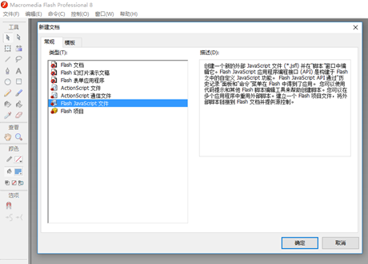
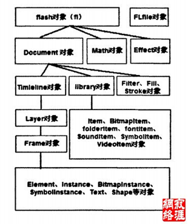
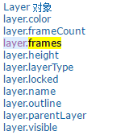
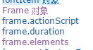
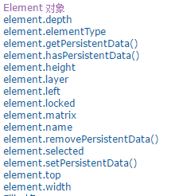
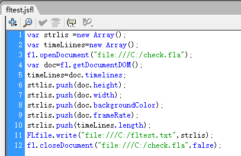
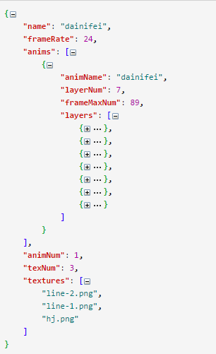
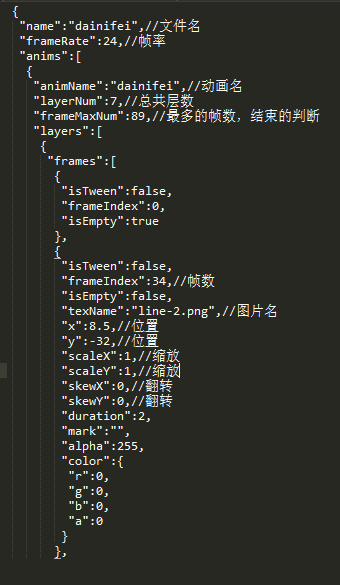
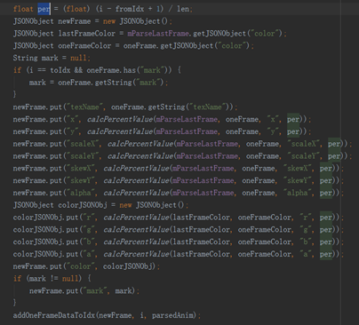
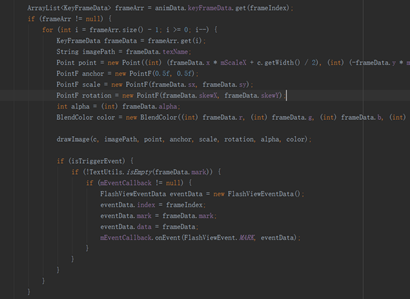

# FlashAnimationToMobile
背景；需求中,UI设计特效变化比较复杂，同时要求兼顾性能，效果与资源包大小。
## 方案调研 
* 序列帧，帧的数量会非常多，资源包太大，同时对内存需求高。
* 代码实现，则太过复杂，耗时耗力，复用难；
* html5，根据炎根的测试，在iphone5上卡顿严重；
* 视频方案，普通视频肯定不可取，资源包太大，同时需要解决背景透明问题。
## Flash动画方案

[FlashAnimationToMobile](https://github.com/hunanldc/FlashAnimationToMobile)这个项目是一个把flash中的关键帧动画及动画路径配置文件导出，然后在iOS／Android原生应用中解析并播放的一个组件。除了原生App，它也能够支持Cocos2dx（3.x）。

用图片与配置信息，使用原生绘制view的方法，能有效减少图片资源包大小。但也限制了flash绘图的部分特效，目前只能使用如下属性：位置，缩放，旋转，切变，颜色叠加，透明度变化。

## Flash关键帧信息怎么获取
### Flash JavaScript API的使用
Flash Javascript API即flash Javascript应用程序编程接口，是一个辅助编程工具。该工具可用来创建在创作环境中运行的脚本。同时，作为扩展Flash的主要部分，Flash JavaScript API提供了在Flash创作环境中(即用户保持Flash程序打开期间)执行多个动作的脚本的功能，这有助于简化创作过程。这意味着，既可以利用其来创作flash动画，也可以利用其来读取fla文件中各种对的属性。

Flash IDE好比浏览器,Flash JavaScript好比浏览器中的JavaScript, 你可以在Flash IDE中编写和运行Flash JavaScript, 它的后缀名为 .jsfla 。

图为Flash专业版8，即是UI为我们制作flash文件的IDE。

JavaScript API基于文档对象模型(DOM)，该模型允许使用JavaScript对象访问Flash文档(即fla文档)。

在flash帮助文档中，提供了对于DOM结构包括各个对象的方法和属性的详细描述。但根据实际情况，一般只需了解其中主要的对象和属性。

图中我们在Document对象下可以看到有Timeline对象，Layer对象，Frame对象，element对象既是项目需要关键信息。

### Flash JavaScript API 文档说明
[http://www.g168.net/txt/flash/ExtendingFlash/index.htm](http://www.g168.net/txt/flash/ExtendingFlash/index.htm)

[http://tool.admin5.com/shouce/flash/ExtendingFlash/](http://tool.admin5.com/shouce/flash/ExtendingFlash/)

[flash_extending_reference.pdf](http://vipwiki.xunlei.cn/download/attachments/2885118/flash_extending_reference.pdf?version=1&modificationDate=1481225415000&api=v2)

例子中获取了DOM对象的宽高，背景色，帧率等。

### 最后需要的配置信息.flajson
项目中提供的脚本，（3导出动画数据.jsfl）能通过DOM对象获取Timeline对象，Layer对象，Frame对象。

通过例子看出先有层layer,再有关键帧frame，关键帧是每个图发生的位移，缩放等信息。

### 绘制
把层的概念淡化，然后在任何一帧，把不同层的图片同时绘制，叠层。逐帧绘制。

因为是关键帧，关键帧与关键帧之间帧的信息需要补全。所以绘制有个关键，计算各个帧的数据，绘制图。

以Android为例。图为读取关键帧信息，方法calcPercentValue换算成Android的绘图的坐标体系。

在自定义View中OnDraw中利用carvas逐帧绘制

